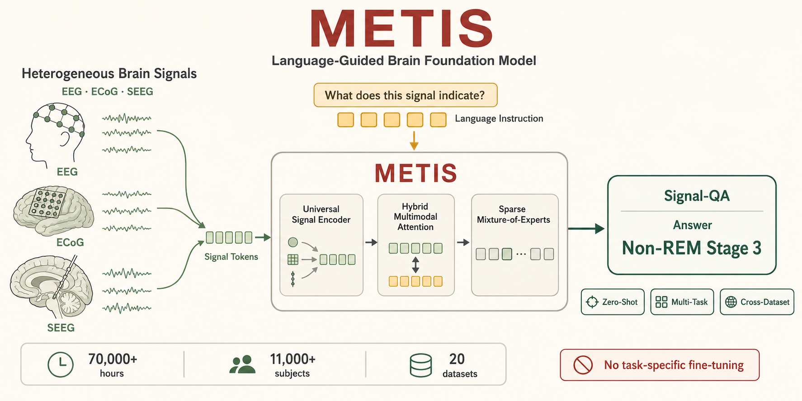
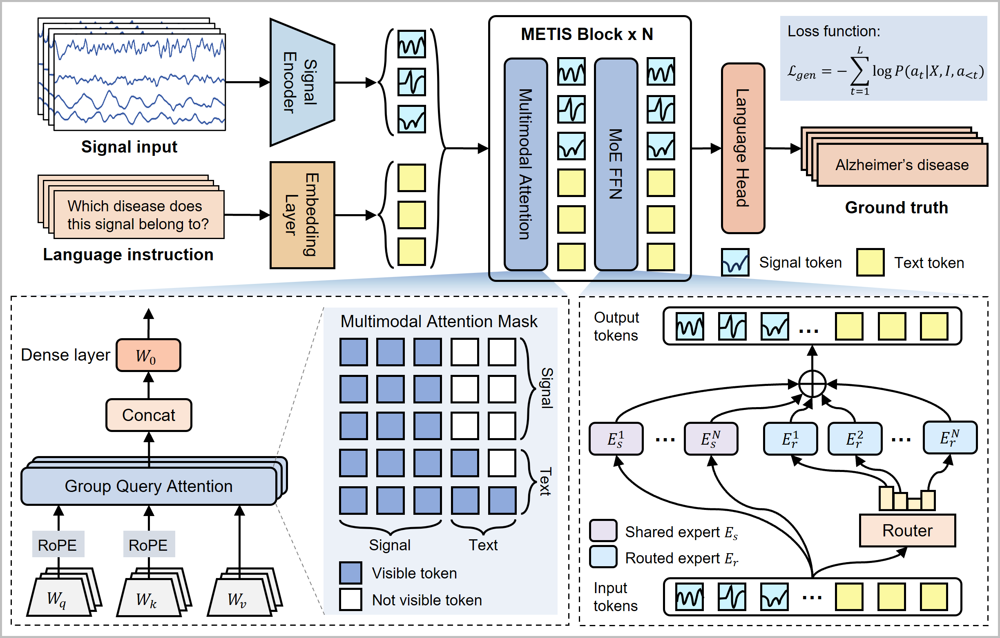

<div align="center">

### A Language-Guided Multimodal Foundation Model for Zero-Shot and Multi-Task Brain Signal Analysis

[](https://doi.org/10.1002/aisy.70486)
[](https://doi.org/10.1002/aisy.70486)
[](https://huggingface.co/cccmmmzzz/metis-brain-signal-foundation-model)
[](LICENSE)



**METIS aligns heterogeneous brain signals with natural-language instructions, turning neural-state assessment and disease identification into a unified Signal-QA problem.**

[Overview](#overview) | [Highlights](#highlights) | [Quick Start](#quick-start) | [Benchmarks](#benchmark-notes) | [Datasets](docs/DATASETS.md) | [Model Card](docs/MODEL_CARD.md) | [Model Zoo](MODEL_ZOO.md) | [Citation](#citation)

</div>

## News

- **July 23, 2026 — Paper published.** METIS is now available in *Advanced Intelligent Systems*. Read the [article](https://doi.org/10.1002/aisy.70486).
- **Checkpoint release.** The METIS checkpoint is available on [Hugging Face](https://huggingface.co/cccmmmzzz/metis-brain-signal-foundation-model).

## Overview

Brain-signal analysis is usually fragmented across task-specific models, acquisition setups, and clinical labels. METIS reframes the problem as language-guided multimodal reasoning: a signal encoder serializes EEG/iEEG recordings into tokens, text prompts provide task semantics, and a multimodal transformer generates clinically meaningful answers.

## Highlights

METIS is packaged around three ideas: instruction-following as the user interface, signal-language alignment as the training target, and heterogeneous EEG/iEEG pretraining as the source of generalization.

| Capability | What METIS Enables |
|---|---|
| **Zero-shot brain-signal analysis** | Answer unseen classification tasks from natural-language prompts without task-specific fine-tuning. |
| **Signal question answering** | Support multiple-choice and open-ended QA grounded in raw EEG/iEEG segments. |
| **Few-shot adaptation** | Use METIS representations as data-efficient features in low-label clinical settings. |
| **Cross-dataset transfer** | Transfer across recording centers, cohorts, modalities, and acquisition distributions. |
| **Task-adaptive computation** | Use MoE routing to specialize computation across heterogeneous brain-signal domains. |

<div align="center">

| Pretraining Scale | Downstream Scope | Reported Gains |
|---:|---:|---:|
| **70,000+ hours** of brain signals | **17** downstream datasets | **20.9%+** average zero-shot accuracy gain over leading generalist models |
| **11,000+ subjects** | **12** zero-shot datasets | Zero-shot performance matching or exceeding supervised task-specific models in multiple settings |
| **20** pretraining datasets | **14** few-shot datasets | **16.0%+** average AUROC advantage in few-shot settings |

</div>

## Architecture

METIS combines a universal signal encoder, multimodal attention, Group Query Attention, and Mixture-of-Experts routing to process heterogeneous EEG/iEEG recordings under natural-language guidance.

<p align="center">
  
</p>

## Signal-QA

METIS makes brain-signal tasks look like a natural interaction:

```text
Signal: 30-second EEG segment
Question: Which sleep stage does this signal belong to?
Options: Wake, Non-REM Stage 1, Non-REM Stage 2, Non-REM Stage 3, Rapid Eye Movement
Answer: Rapid Eye Movement
```

The same interface supports disease detection, seizure-state identification, anomaly screening, anesthesia-depth monitoring, and other clinical signal tasks.

## Quick Start

The zero-shot demo expects the following local files:

```text
checkpoints/metis.pt
demo_data/isruc_demo.npz
```

Download the checkpoint from [Hugging Face](https://huggingface.co/cccmmmzzz/metis-brain-signal-foundation-model/resolve/main/metis.pt) and place it at `checkpoints/metis.pt`. The demo dataset is included at `demo_data/isruc_demo.npz`.

Then run:

```bash
pip install torch transformers numpy einops
python zero_shot_demo.py
```

Example output:

```text
[Multiple-choice QA]
Question: Which sleep stage does this signal belong to? Options: (A)Wake (B)Non-REM Stage 1 (C)Non-REM Stage 2 (D)Non-REM Stage 3 (E)Rapid Eye Movement
Prediction: A Wake
Answer: A Wake

[Detailed QA]
Question: Which sleep stage does this signal belong to?
Prediction: Wake
Answer: Wake

[Multiple-choice Accuracy]
Accuracy: 622/772 = 80.57%
```

The demo runs multiple-choice zero-shot classification, open-ended Signal-QA generation, and a small accuracy check.

## Signal-Only Classification Fine-Tuning

For downstream classification without text input, initialize a `MetisClassifier`, load the pretrained METIS backbone, and train the classification head together with the model as needed:

```python
import torch

from METIS import MetisClassifier, MetisConfig

config = MetisConfig(num_classes=5)
model = MetisClassifier(config)

# Load the pretrained METIS backbone.
checkpoint = torch.load("checkpoints/metis.pt", map_location="cpu")
model.backbone.load_state_dict(checkpoint, strict=False)

# A dummy brain-signal batch: batch_size=1, channels=10, length=1000
x = torch.randn(1, 10, 1000)

y = model(x)

print(y.shape)  # torch.Size([1, 5])
```

## Benchmark Notes

Detailed benchmark figures and per-dataset result tables are kept in the manuscript materials. The repository summarizes the evaluation modes and main claims in [docs/BENCHMARKS.md](docs/BENCHMARKS.md).

## Discussion and Collaboration

We believe that integrating language with multimodal brain signals has significant potential for building general-purpose foundation models for neuroscience and healthcare. Many important questions in multimodal alignment, cross-dataset generalization, instruction tuning, and interpretable neural-language modeling remain to be explored.

If you are interested in this direction or would like to discuss it further, please feel free to contact Mingzhi Chen at Mingzhi.Chen@mbzuai.ac.ae. For questions about the code or reproducibility, please open a GitHub issue.

## Citation

If METIS supports your research, please cite the published article:

> Mingzhi Chen, Yiyu Gui, Guibo Luo, and Yuchao Yang. “A Language-Guided Multimodal Foundation Model for Zero-Shot and Multi-Task Brain Signal Analysis.” *Advanced Intelligent Systems*, e70486, 2026. [https://doi.org/10.1002/aisy.70486](https://doi.org/10.1002/aisy.70486)

```bibtex
@article{chen2026language,
  title     = {A Language-Guided Multimodal Foundation Model for Zero-Shot and Multi-Task Brain Signal Analysis},
  author    = {Chen, Mingzhi and Gui, Yiyu and Luo, Guibo and Yang, Yuchao},
  journal   = {Advanced Intelligent Systems},
  pages     = {e70486},
  year      = {2026},
  publisher = {Wiley Online Library},
  doi       = {10.1002/aisy.70486}
}
```
