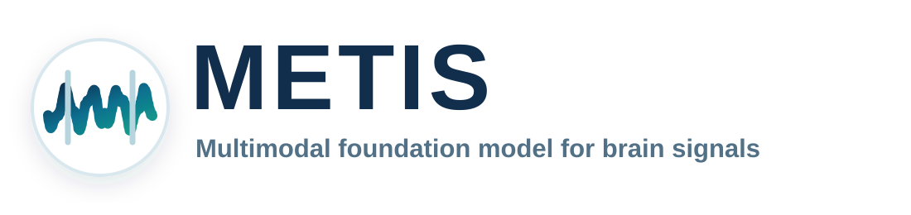
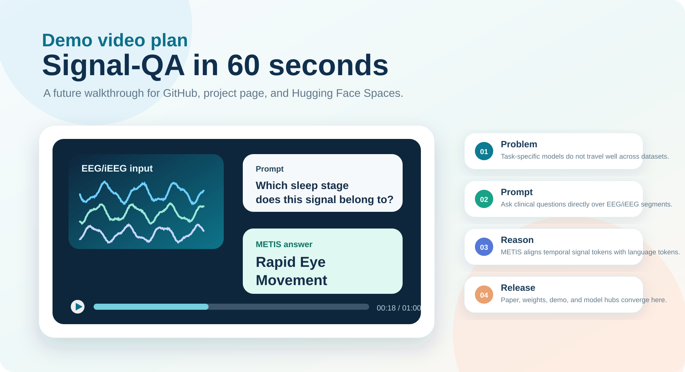

<div align="center">



### A Language-guided Multimodal Foundation Model for Zero-shot and Multi-task Brain Signal Analysis

[](#citation)
[](docs/SHOWCASE_PLAN.md#project-page)
[](docs/SHOWCASE_PLAN.md#demo-video)
[](MODEL_ZOO.md)
[](MODEL_ZOO.md)
[](LICENSE_PENDING.md)


**METIS aligns heterogeneous brain signals with natural-language instructions, turning neural-state assessment and disease identification into a unified Signal-QA problem.**

[Overview](#overview) | [Highlights](#highlights) | [Pseudocode](#public-pseudocode) | [Release Roadmap](#release-roadmap) | [Data Policy](docs/DATA_POLICY.md) | [Model Card](docs/MODEL_CARD.md) | [Model Zoo](MODEL_ZOO.md) | [Citation](#citation)

</div>

## News

- **Release plan.** Code, checkpoints, and inference examples will be organized for a public release after publication review.
- **Showcase plan.** The repository is prepared for a staged release with paper links, a project page, demo video, Hugging Face / ModelScope cards, and cleaned inference examples. See [docs/SHOWCASE_PLAN.md](docs/SHOWCASE_PLAN.md).

## Overview

Brain-signal analysis is usually fragmented across task-specific models, acquisition setups, and clinical labels. METIS reframes the problem as language-guided multimodal reasoning: a signal encoder serializes EEG/iEEG recordings into tokens, text prompts provide task semantics, and a multimodal transformer generates clinically meaningful answers.

## Highlights

METIS is packaged around three ideas: instruction-following as the user interface, signal-language alignment as the training target, and heterogeneous EEG/iEEG pretraining as the source of generalization.

| Capability | What METIS Enables |
|---|---|
| **Zero-shot brain-signal analysis** | Answer unseen classification tasks from natural-language prompts without task-specific fine-tuning. |
| **Signal question answering** | Support multiple-choice and open-ended QA grounded in raw EEG/iEEG segments. |
| **Few-shot adaptation** | Use METIS representations as data-efficient features in low-label clinical settings. |
| **Transfer-oriented design** | Keep the architecture and prompt interface usable across heterogeneous signal settings. |
| **Task-adaptive computation** | Use MoE routing to specialize computation across heterogeneous brain-signal domains. |

<div align="center">

| Public Surface | What Is Included | What Is Omitted |
|---:|---:|---:|
| **Model architecture** | METIS implementation and configuration | Private checkpoints |
| **Training flow** | Public pseudocode for signal-instruction pretraining | Private paths and data loaders |
| **Zero-shot flow** | Public pseudocode for option scoring | Dataset-specific evaluation code |

</div>

## Architecture

METIS combines a universal signal encoder, multimodal attention, Group Query Attention, and Mixture-of-Experts routing to process heterogeneous EEG/iEEG recordings under natural-language guidance.

<p align="center">
  
</p>

## Public Pseudocode

This repository keeps the public code surface focused on architecture and safe pseudocode. Data-specific loaders, private file paths, subject metadata, and restricted preprocessing details are intentionally omitted.

| File | Purpose |
|---|---|
| [`METIS.py`](METIS.py) | METIS model architecture. |
| [`pretrain_Metis.py`](pretrain_Metis.py) | Pseudocode for signal-instruction pretraining. |
| [`test_zero_shot.py`](test_zero_shot.py) | Pseudocode for zero-shot option scoring. |
| [`docs/DATA_POLICY.md`](docs/DATA_POLICY.md) | Public data-handling policy. |

The zero-shot interface follows this abstract pattern:

```text
Signal: preprocessed brain-signal segment
Question: natural-language task prompt
Options: candidate answer strings
Answer: option selected from next-token scores
```

## Benchmark Notes

Detailed benchmark tables and dataset-specific evaluation code are not included
in this public repository. They will be documented through publication materials
or separate release artifacts when sharing terms allow it.

## Release Roadmap

<p align="center">
  
</p>

| Surface | Role | Status |
|---|---|---|
| Paper / arXiv / DOI | Official citation and technical report | Planned after publication metadata is available |
| Project page | Polished public landing page with figures, demo clip, and benchmark highlights | Planned |
| Demo video | Short Signal-QA walkthrough for GitHub, project page, and model hubs | Storyboard prepared |
| Hugging Face | Model card, collection, checkpoint release, and optional Space | Template prepared in [docs/HF_MODEL_CARD_TEMPLATE.md](docs/HF_MODEL_CARD_TEMPLATE.md) |
| ModelScope | China-accessible mirror for model assets and demo materials | Planned |

## Repository Map

```text
metis-brain-signal-foundation-model/
|-- assets/                 # README figures and social preview assets
|   |-- metis_wordmark.svg   # project wordmark
|   |-- metis_hero.svg       # README hero visual
|-- docs/                   # model, dataset, and benchmark documentation
|-- MODEL_ZOO.md            # checkpoint release table and usage status
|-- README.md               # public-facing project homepage
|-- CITATION.cff            # citation metadata
`-- LICENSE_PENDING.md      # release/license note before publication
```

## Release Status

| Component | Status | Notes |
|---|---|---|
| Training code | Planned | To be cleaned and documented before public release. |
| Inference demo | Planned | Will include minimal examples for Signal-QA and classification. |
| Model weights | Upon publication | Intended for non-commercial academic use, subject to final license. |
| Data interface | Pseudocode | Private loaders and restricted metadata are intentionally omitted. |
| Benchmark scripts | Planned | Public recipes will be added only when sharing terms allow it. |

Before making the repository public, use [RELEASE_CHECKLIST.md](RELEASE_CHECKLIST.md) to review links, license terms, dataset restrictions, and reproducibility notes.

## Citation

If you find METIS useful, please cite the paper once the final bibliographic record is available.

```bibtex
@article{metis2026,
  title   = {A Language-guided Multimodal Foundation Model for Zero-shot and Multi-task Brain Signal Analysis},
  author  = {{METIS Contributors}},
  year    = {2026},
  note    = {Manuscript; publication metadata pending}
}
```

## Contact

For research questions, please open a GitHub issue after the repository becomes public, or contact the corresponding authors listed in the manuscript.
