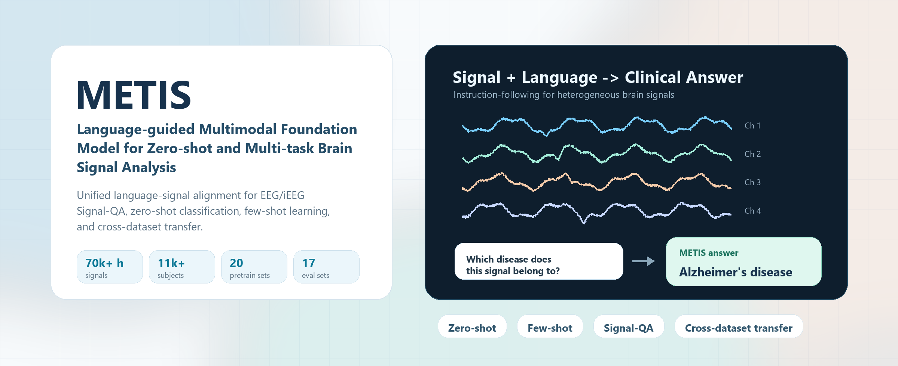
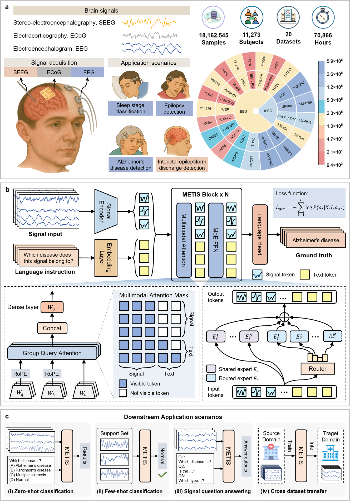
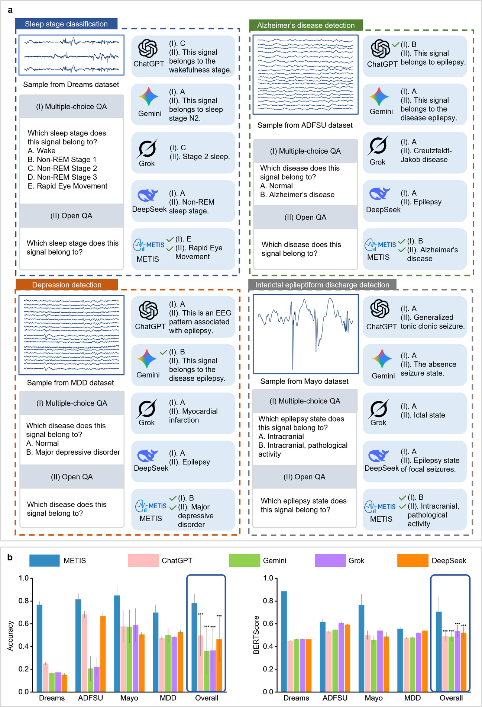
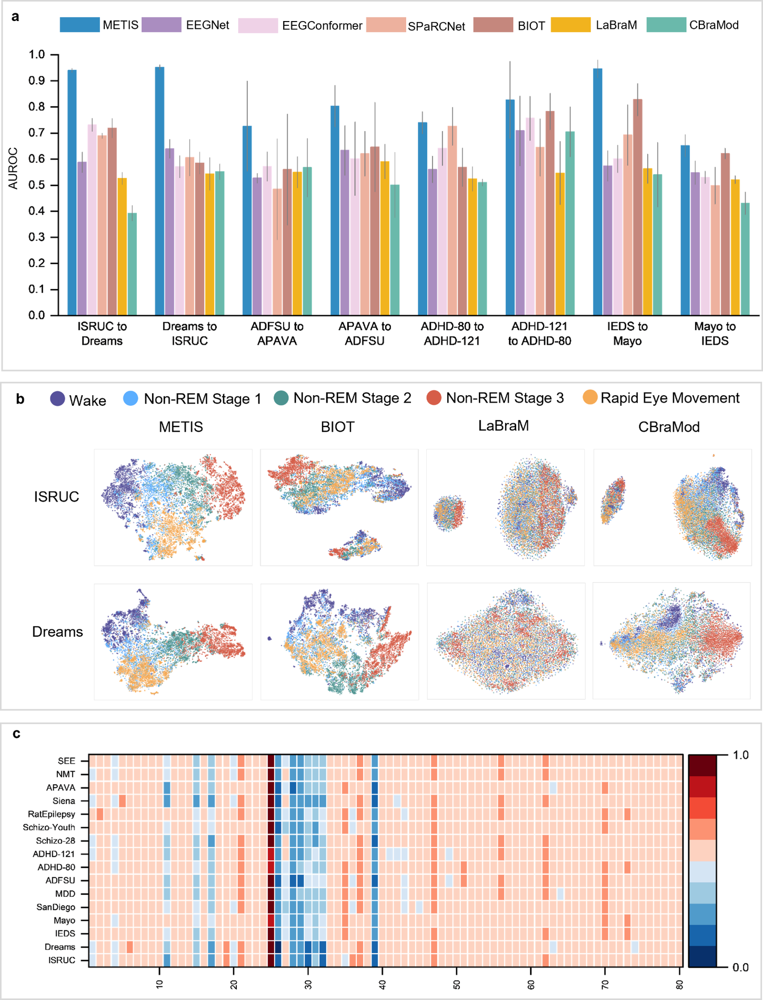

<div align="center">



# METIS

**A Language-guided Multimodal Foundation Model for Zero-shot and Multi-task Brain Signal Analysis**

[](#citation)
[](MODEL_ZOO.md)
[](LICENSE_PENDING.md)
[](docs/DATASETS.md)

METIS aligns heterogeneous brain signals with natural-language instructions, turning neural-state assessment and disease identification into a unified Signal-QA problem.

[Overview](#overview) | [Highlights](#highlights) | [Benchmarks](#benchmark-snapshots) | [Datasets](docs/DATASETS.md) | [Model Card](docs/MODEL_CARD.md) | [Model Zoo](MODEL_ZOO.md) | [Citation](#citation)

</div>

## News

- **Release plan.** Code, checkpoints, and inference examples will be organized for a public release after publication review.
- **Repository polish.** This README and the companion docs are prepared as the public-facing package layer; model code remains unchanged.

## Overview

Brain-signal analysis is usually fragmented across task-specific models, acquisition setups, and clinical labels. METIS reframes the problem as language-guided multimodal reasoning: a signal encoder serializes EEG/iEEG recordings into tokens, text prompts provide task semantics, and a multimodal transformer generates clinically meaningful answers.

## Highlights

METIS is packaged around three ideas: instruction-following as the user interface, signal-language alignment as the training target, and heterogeneous EEG/iEEG pretraining as the source of generalization.

| Capability | What METIS Enables |
|---|---|
| **Zero-shot brain-signal analysis** | Answer unseen classification tasks from natural-language prompts without task-specific fine-tuning. |
| **Signal question answering** | Support multiple-choice and open-ended QA grounded in raw EEG/iEEG segments. |
| **Few-shot adaptation** | Use METIS representations as data-efficient features in low-label clinical settings. |
| **Cross-dataset transfer** | Transfer across recording centers, cohorts, modalities, and acquisition distributions. |
| **Task-adaptive computation** | Use MoE routing to specialize computation across heterogeneous brain-signal domains. |

<div align="center">

| Pretraining Scale | Downstream Scope | Reported Gains |
|---:|---:|---:|
| **70,000+ hours** of brain signals | **17** downstream datasets | **20.9%+** average zero-shot accuracy gain over leading generalist models |
| **11,000+ subjects** | **12** zero-shot datasets | Zero-shot performance matching or exceeding supervised task-specific models in multiple settings |
| **20** pretraining datasets | **14** few-shot datasets | **16.0%+** average AUROC advantage in few-shot settings |

</div>

## Architecture

METIS combines a universal signal encoder, multimodal attention, Group Query Attention, and Mixture-of-Experts routing to process heterogeneous EEG/iEEG recordings under natural-language guidance.

<p align="center">
  
</p>

## Signal-QA

METIS makes brain-signal tasks look like a natural interaction:

```text
Signal: 30-second EEG segment
Question: Which sleep stage does this signal belong to?
Options: Wake, N1, N2, N3, REM
Answer: Rapid Eye Movement
```

The same interface supports disease detection, seizure-state identification, anomaly screening, anesthesia-depth monitoring, and other clinical signal tasks.

## Benchmark Snapshots

### Zero-shot Multi-task Performance

<p align="center">
  
</p>

### Beyond General-purpose Multimodal Models

General-purpose multimodal models often show thematic bias or modality confusion when forced to interpret temporal brain signals directly. METIS is trained to ground language in EEG/iEEG signal structure.

<p align="center">
  
</p>

### Transfer, Representation Geometry, and Expert Routing

<p align="center">
  
</p>

More details are available in [docs/BENCHMARKS.md](docs/BENCHMARKS.md).
High-resolution PDF versions of the manuscript figures are available in [assets/pdf](assets/pdf).

## Repository Map

```text
metis-brain-signal-foundation-model/
|-- assets/                 # README figures and social preview assets
|-- docs/                   # model, dataset, and benchmark documentation
|-- MODEL_ZOO.md            # checkpoint release table and usage status
|-- README.md               # public-facing project homepage
|-- CITATION.cff            # citation metadata
`-- LICENSE_PENDING.md      # release/license note before publication
```

## Release Status

| Component | Status | Notes |
|---|---|---|
| Training code | Planned | To be cleaned and documented before public release. |
| Inference demo | Planned | Will include minimal examples for Signal-QA and classification. |
| Model weights | Upon publication | Intended for non-commercial academic use, subject to final license. |
| Dataset preprocessing | Planned | Public datasets will be linked with preprocessing notes where redistribution is restricted. |
| Benchmark scripts | Planned | Evaluation recipes will mirror the paper settings as closely as possible. |

Before making the repository public, use [RELEASE_CHECKLIST.md](RELEASE_CHECKLIST.md) to review links, license terms, dataset restrictions, and reproducibility notes.

## Citation

If you find METIS useful, please cite the paper once the final bibliographic record is available.

```bibtex
@article{chen2026metis,
  title   = {A Language-guided Multimodal Foundation Model for Zero-shot and Multi-task Brain Signal Analysis},
  author  = {Chen, Mingzhi and Gui, Yiyu and Luo, Guibo and Yang, Yuchao},
  year    = {2026},
  note    = {Manuscript; publication metadata pending}
}
```

## Contact

For research questions, please open a GitHub issue after the repository becomes public, or contact the corresponding authors listed in the manuscript.
