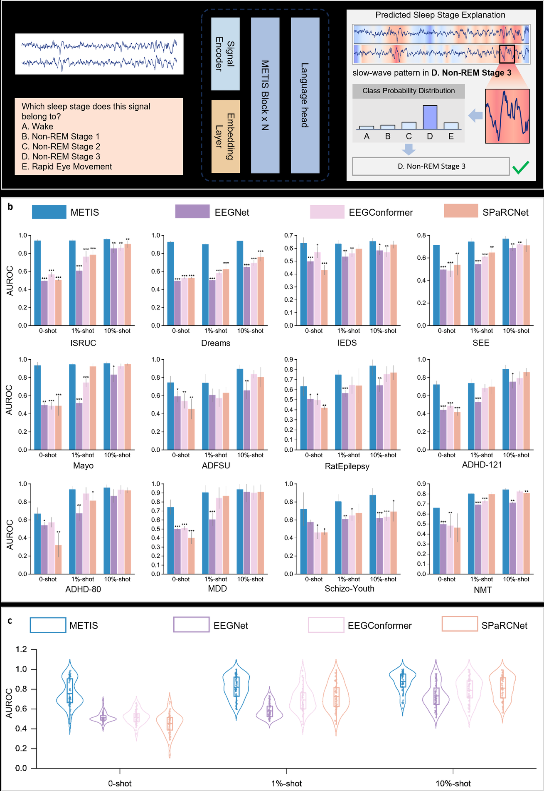
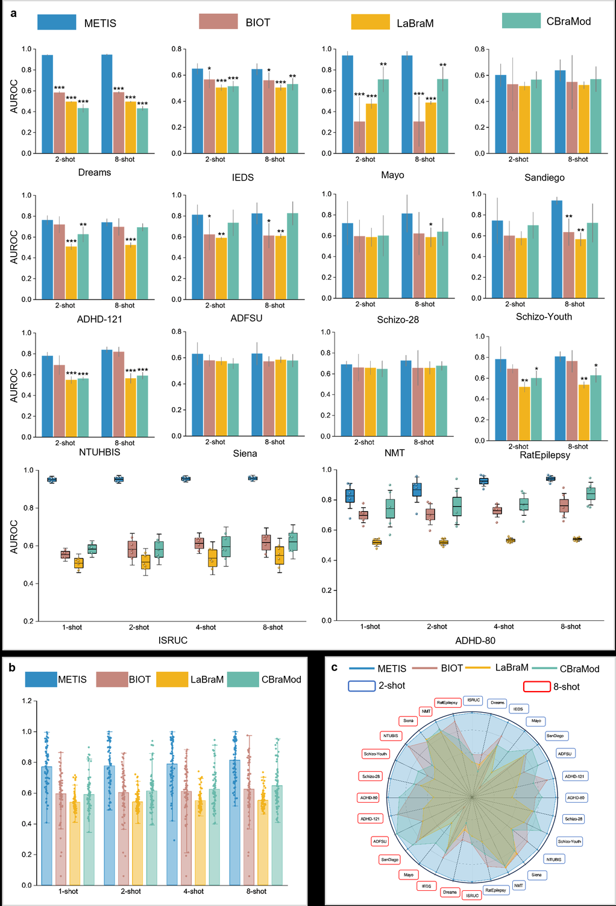
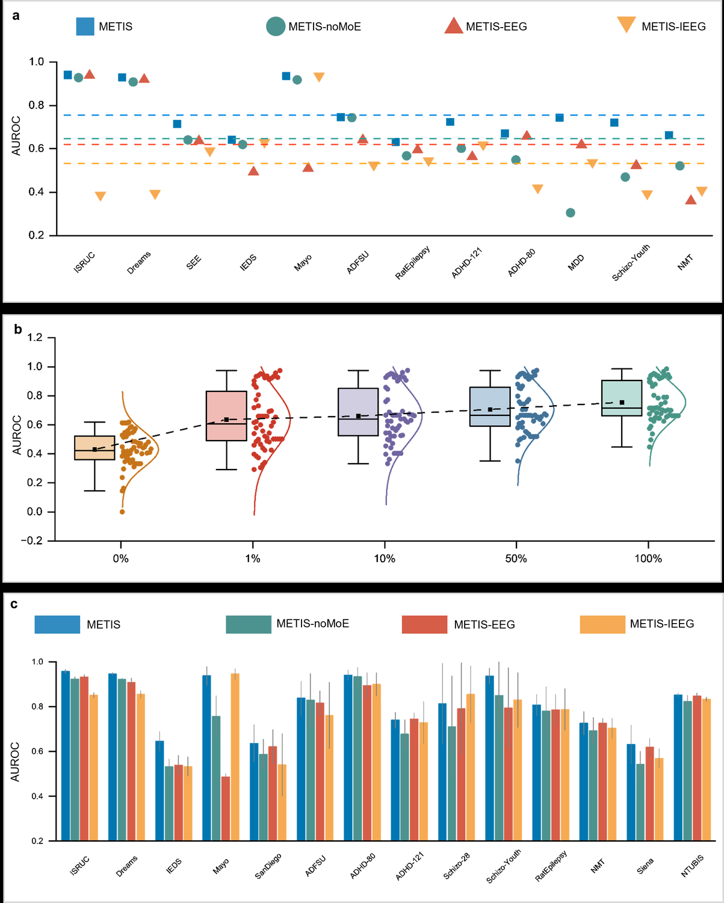

# Benchmarks

This page summarizes the result story used in the manuscript-facing README. Exact per-dataset tables can be added when the evaluation scripts are cleaned.

## Evaluation Modes

| Mode | Description | Why It Matters |
|---|---|---|
| Zero-shot classification | The pretrained model receives a signal and natural-language query without target-task fine-tuning. | Tests whether language-signal alignment can replace task-specific retraining. |
| Signal-QA | The model answers multiple-choice or open-ended questions grounded in brain signals. | Makes brain-signal analysis closer to a general assistant interface. |
| Few-shot classification | Frozen representations are evaluated with a small number of labeled examples. | Measures data efficiency in low-label clinical settings. |
| Cross-dataset transfer | Models train on a source dataset and evaluate on a distinct target dataset. | Tests robustness to center, cohort, hardware, and distribution shifts. |

## Key Manuscript Claims

- METIS is pretrained on more than 70,000 hours of EEG/iEEG recordings from more than 11,000 subjects across 20 datasets.
- In zero-shot evaluation across 12 datasets, METIS outperforms leading general-purpose multimodal models by more than 20.9% in average accuracy.
- In few-shot settings across 14 datasets, METIS reports an average AUROC advantage above 16.0%.
- In cross-dataset transfer, METIS reports an average AUROC advantage of 15.9%.
- Ablations indicate that MoE routing, joint EEG/iEEG pretraining, and pretraining scale all contribute to robustness.

## Visual Summary

  

  

  

## Open Items Before Release

- Add machine-readable result tables under `results/`.
- Add scripts that reproduce the main paper figures from raw metrics.
- Add prompt templates used for multiple-choice and open-ended Signal-QA.
- Add statistical test details and random seed handling.
