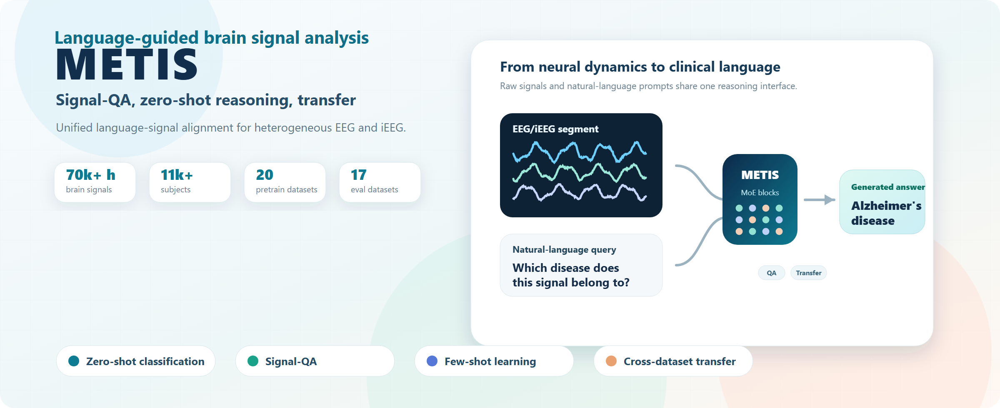

# Hugging Face Model Card Template

This is a draft structure for the future METIS Hugging Face model card. Replace placeholders only after the paper, license, and checkpoint release details are finalized.

---
license: pending
language:
  - en
tags:
  - eeg
  - ieeg
  - brain-signal-analysis
  - multimodal
  - foundation-model
  - signal-qa
  - zero-shot-classification
pipeline_tag: feature-extraction
library_name: pytorch
---

# METIS

**METIS: A Language-guided Multimodal Foundation Model for Zero-shot and Multi-task Brain Signal Analysis**

METIS aligns heterogeneous EEG/iEEG recordings with natural-language instructions, enabling Signal-QA, zero-shot classification, few-shot learning, and cross-dataset transfer.



## Release Status

| Asset | Status |
|---|---|
| Paper | Pending |
| Checkpoint | Pending publication |
| Inference demo | Planned |
| Evaluation scripts | Planned |
| License | Pending |

## Intended Use

- Research on brain-signal foundation models
- EEG/iEEG representation learning
- Zero-shot and few-shot brain-signal analysis
- Signal-QA benchmarking

## Out-of-scope Use

METIS is a research model and is not a standalone clinical diagnostic system. Clinical use requires prospective validation, regulatory review, and expert oversight.

## Model Details

| Field | Value |
|---|---|
| Architecture | Signal encoder + multimodal transformer + MoE |
| Modalities | EEG, iEEG |
| Layers | 12 |
| Hidden size | 512 |
| MoE | 8 routed experts + 1 shared expert |
| Pretraining corpus | 70,000+ hours, 11,000+ subjects, 20 datasets |

## Example

```text
Signal: EEG/iEEG segment
Question: Which disease does this signal belong to?
Answer: Alzheimer's disease
```

## Citation

```bibtex
@article{chen2026metis,
  title   = {A Language-guided Multimodal Foundation Model for Zero-shot and Multi-task Brain Signal Analysis},
  author  = {Chen, Mingzhi and Gui, Yiyu and Luo, Guibo and Yang, Yuchao},
  year    = {2026},
  note    = {Manuscript; publication metadata pending}
}
```
