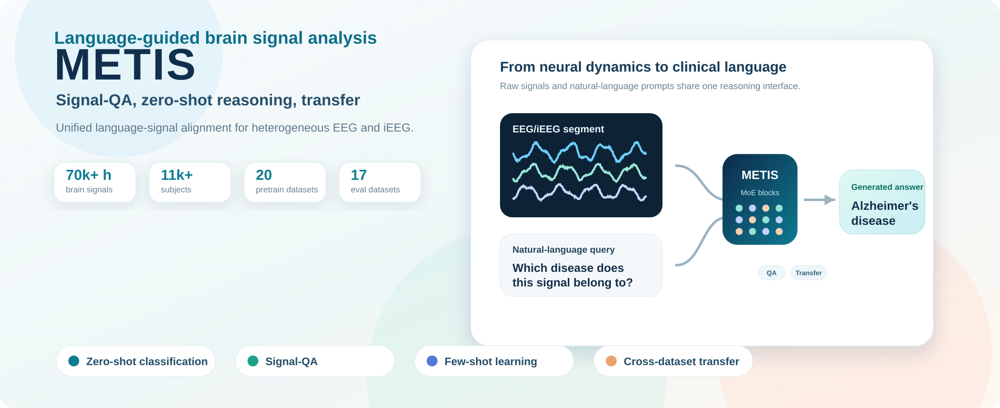

# METIS Model Card

## Model Summary

METIS is a language-guided multimodal foundation model for brain-signal analysis. It maps EEG/iEEG recordings and natural-language prompts into a shared generative interface for zero-shot classification, Signal-QA, few-shot adaptation, and cross-dataset transfer.

## Architecture

- universal signal encoder for heterogeneous EEG/iEEG inputs
- multimodal attention over signal and text tokens
- Group Query Attention
- Mixture-of-Experts feed-forward layers
- 12 transformer layers
- hidden dimension 512
- 8 routed experts and 1 shared expert in MoE layers

  

## Intended Use

- academic research in brain-signal foundation models
- zero-shot and few-shot EEG/iEEG analysis
- benchmarking language-guided physiological signal models
- representation learning for clinical time-series tasks

## Out-of-scope Use

METIS is a research model and should not be used as a standalone clinical diagnostic system. Any clinical use requires prospective validation, regulatory review, and expert oversight.

## Known Limitations

- public or private evaluation sources may underrepresent rare diseases, acquisition hardware, and global populations
- downstream performance can depend on preprocessing, channel availability, and segment duration
- open-ended Signal-QA requires careful evaluation to avoid plausible but clinically incorrect text
- model weights and license terms are pending final publication decisions
